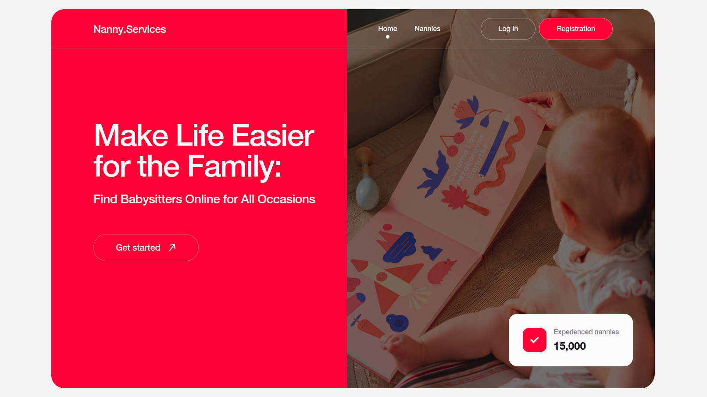
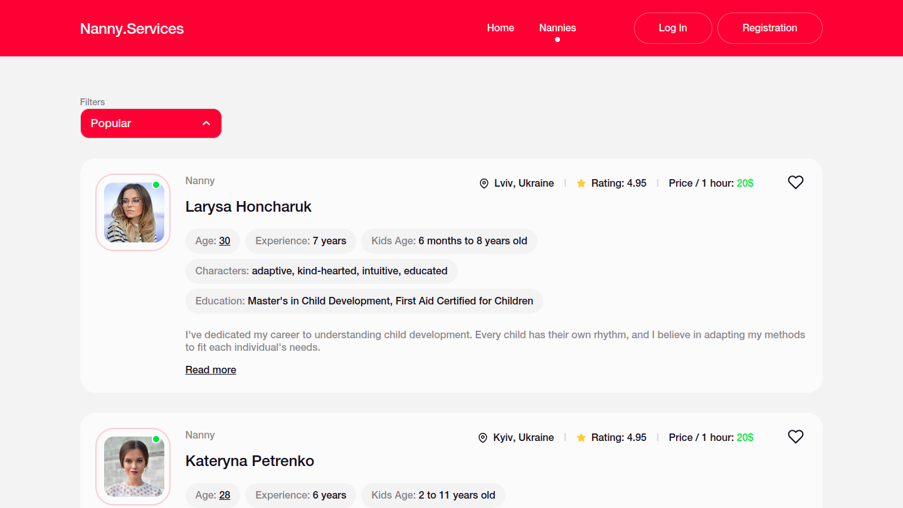
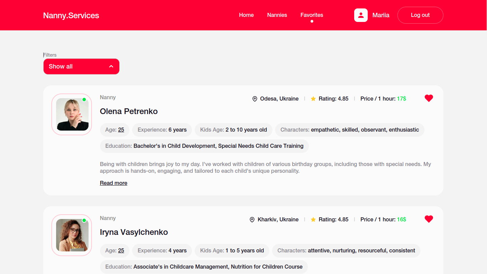
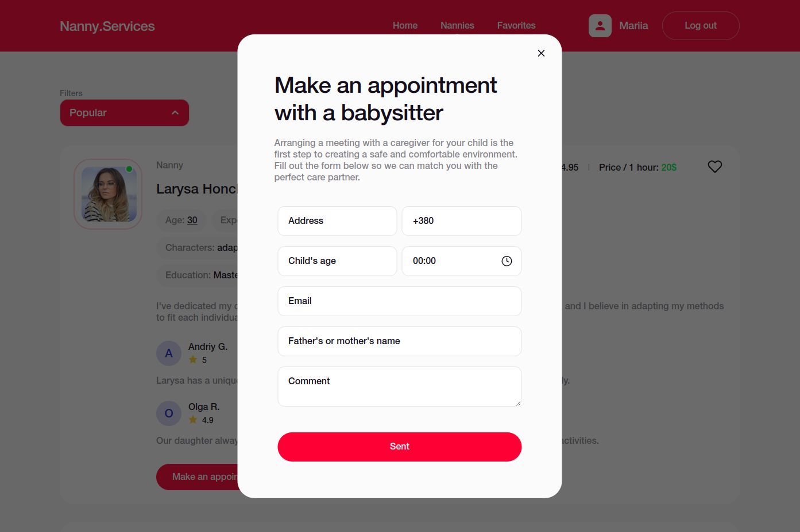

# Nanny.Services - React Application

## Table of contents

- [Description](#description)
- [Screenshots](#screenshots)
- [Features](#features)
- [Technologies](#technologies)
- [Project Layout and Requirements](#project-layout-and-requirements)
- [Contributing](#contributing)

## Description

Nanny.Services is a React-based application that provides a user-friendly platform for families to find reliable and trustworthy childcare providers. With a straightforward interface and powerful search capabilities, this app makes it easy to connect with the perfect nanny to meet your family's needs. The application is designed with three main pages, each tailored to different aspects of finding and managing childcare services.

## Screenshots

_Home page_

_Nannies catalog page_

_Favorites page_

_Appointment form for booking nannies_

## Features

- Nanny Listings: Browse a comprehensive list of nannies, complete with photos, ratings, and detailed information.
- Sorting and Filtering: Sort nannies by criteria like popularity, price, and alphabetical order to find the best match.
- Read Reviews: Check out reviews left by other families to make an informed decision.
- Appointment Booking: Book a time slot with your preferred nanny directly through the app.
- Favorites Management: Save your favorite nannies to a personal list for quick access later.
- User-Specific Data: All data is stored uniquely per user, ensuring a personalized experience.

## Technologies

- React.js: The core framework used for building the frontend.
- Firebase Authentication: Manages user authentication and authorization securely.
- Firebase Realtime Database: Provides real-time data synchronization and management.
- Styled-components: Enables modular and scoped CSS for component styling.
- React Router: Facilitates seamless navigation across different pages of the app.

## Project Layout and Requirements

This project repository includes essential documents and resources to guide the development process:

- **Project Layout**:
  [Project Mockup on Figma](https://www.figma.com/file/u36ajEOsnwio2GDGiabVPD/Nanny-Sevices?type=design&node-id=0-1&mode=design&t=01CgTCIu4cCSpGmU-0): View the visual design and layout of the application.
- **Project Requirements**:
  - [Project Requirements](https://docs.google.com/document/d/19ugM1gvOw81nCyALr4EZs3dmv6OfJm94VjupcytbnJY/edit): Review the technical specifications and functional requirements for the project.

## Contributing

We welcome contributions! If you have suggestions for improvements or have found a bug, please open a new issue or submit a pull request. Your feedback will help to make Nanny.Services better for everyone.
